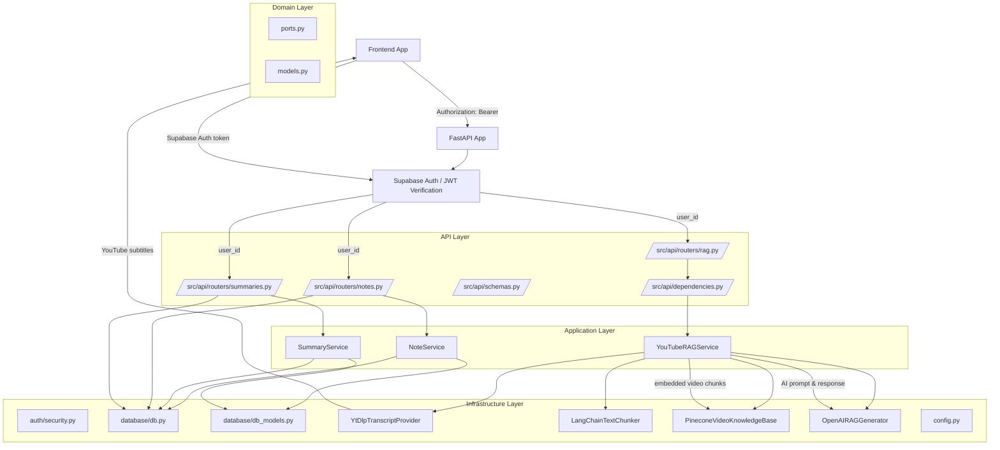
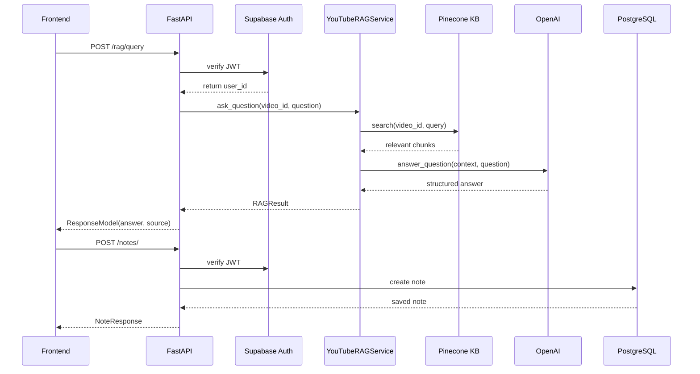
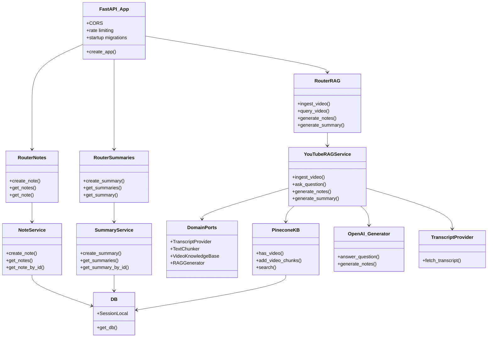

# Backend Architecture Graphs

This document describes the current backend architecture for YouTube Better, including the main modules, how requests flow from the frontend to external systems, and the clean architecture boundaries that separate concerns.

## High-Level Architecture

## How the Backend Works

### 1. Application startup
- `main.py` configures the environment and starts the FastAPI server.
- `src/api/app.py` creates the FastAPI app, configures CORS and rate limiting, registers routers, and runs Alembic migrations on startup.
- `src/bootstrap.py` wires concrete infrastructure adapters into the `YouTubeRAGService` using the protocol abstractions in `src/domain/ports.py`.

### 2. Authentication
- Every protected endpoint depends on `src.infrastructure.auth.security.get_current_user`.
- JWT validation is done against Supabase using:
  - JWKS verification for `ES256`/`RS256`, or
  - HS256 verification using `SUPABASE_JWT_SECRET`, or
  - Supabase Auth `/auth/v1/user` endpoint fallback.
- The authenticated Supabase `user_id` is passed into route handlers.

### 3. RAG ingestion and query flow
- `POST /rag/ingest` calls `YouTubeRAGService.ingest_video(video_id)`.
- Transcript provider (`YtDlpTranscriptProvider`) fetches YouTube subtitles via `yt-dlp` and HTTP.
- `LangChainTextChunker` splits transcript text into overlapping chunks.
- `PineconeVideoKnowledgeBase` embeds chunks locally with Ollama and upserts them to Pinecone under the video namespace.

### 4. Question answering and generation flow
- `POST /rag/query` and `POST /rag/generate-notes` / `POST /rag/generate-summary` all use the same service pipeline.
- The knowledge base searches for relevant chunks for `video_id` and query/topic.
- Selected chunks are combined into a context string.
- `OpenAIRAGGenerator` sends a structured prompt to OpenAI using `ChatOpenAI`.
- The response is returned as `RAGResult(answer, source)`.

### 5. Notes and summaries persistence
- `NoteService` and `SummaryService` both use `src.infrastructure.database.db.get_db()`.
- Persistent storage is managed through SQLAlchemy and PostgreSQL.
- `DBNote` and `DBSummary` tables store `user_id`, `video_id`, `content`, and `created_at`.

## Sequence Diagram: Request to Response

## Clean Architecture Map

## Notes
- The backend uses a dependency inversion strategy: concrete adapters are assembled in `src/bootstrap.py`, while the rest of the code depends on protocols in `src/domain/ports.py`.
- Supabase Auth is used for authentication only; user data persists in PostgreSQL via SQLAlchemy.
- The RAG pipeline combines transcript retrieval, local embedding, vector search, and OpenAI structured generation.
