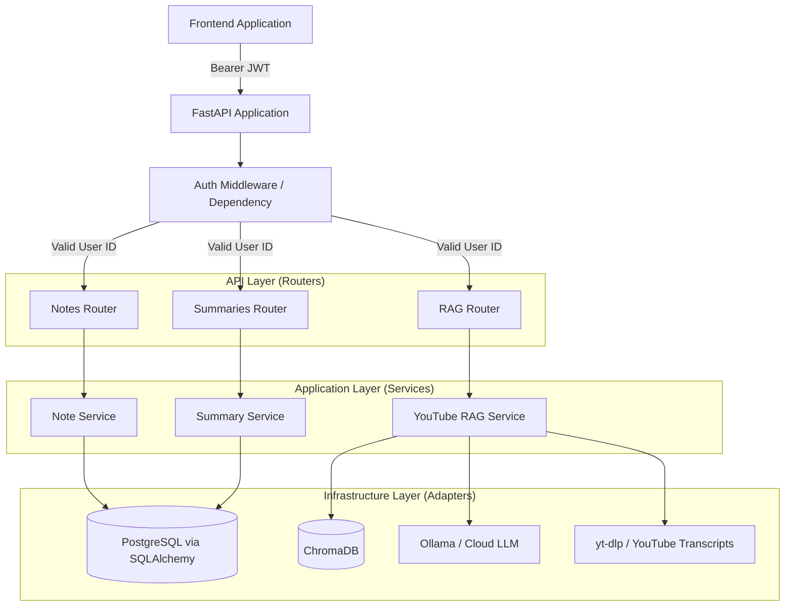
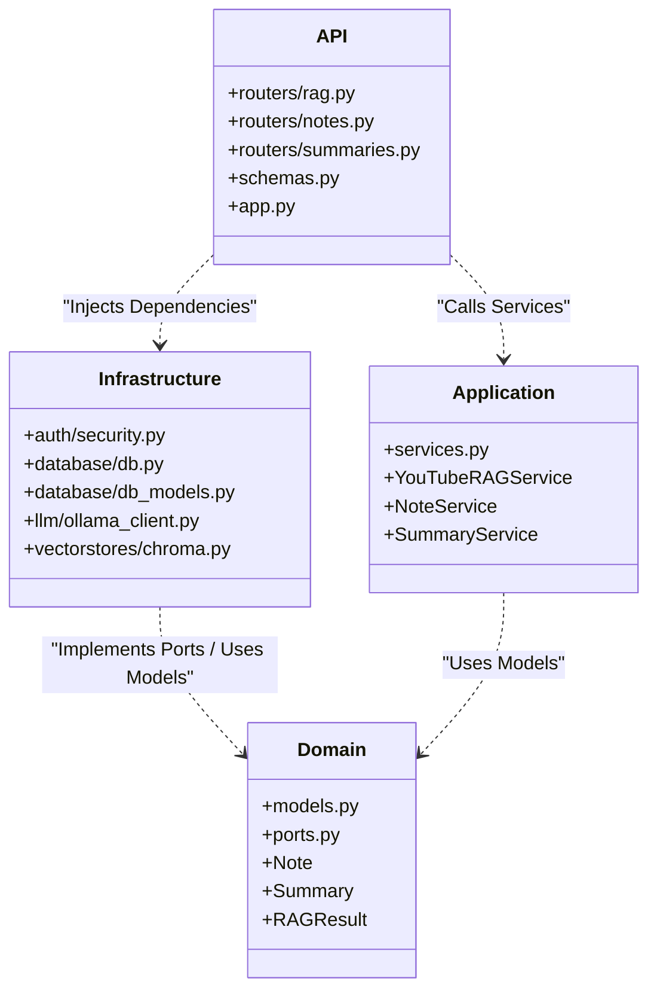

# Backend Architecture Graphs

Below are the architectural diagrams illustrating the core structures and flows of the YouTube Better backend.

## System Overview & Flow

## Clean Architecture Boundaries

